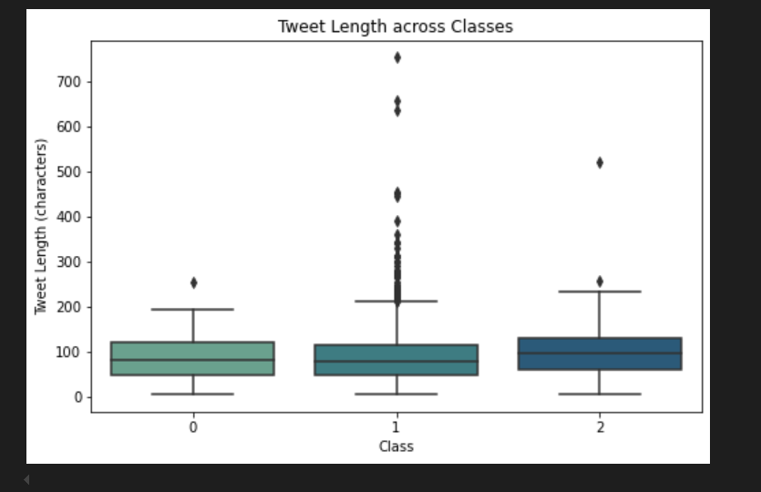

# Cyberbullying Detection System

| | GROUP MEMBERS | GITHUB | 
| --- | --- | --- |
| 1. | ROBINSON KARASHA | https://github.com/RobinsonKarasha |
| 2. | MAUREEN WAMBUGU | https://github.com/Mau-Wambugu |
| 3. | NATALIE OMONDI | https://github.com/akeyo03/capstone_project_phase5 |
| 4. | JAMES KAMAU | https://github.com/kamahTek |
| 5. | MARTIN OMONDI| https://github.com/ogutu-23 |
| 6. | ANDREW MANWA| https://github.com/sagwe0 |

## 1.BUSINESS UNDERSTANDING
> PROJECT OVERVIEW

This project aims to create an automated detection system that leverages NLP and machine learning, particularly neural networks, to identify and categorize offensive, hateful, or negative language in social media comments.

**Objective**

By detecting and filtering harmful comments, we can help social media platforms minimize the exposure of users to cyberbullying .

 > BUSINESS PROBLEM

With the rise of social media, millions of users are regularly exposed to negative and harmful interactions, leading to an increase in mental health issues, such as anxiety, depression, stress, and low self-esteem.
Social media platforms need a proactive solution to detect and mitigate cyberbullying, reducing its psychological toll on users and enhancing overall user experience.

> PROJECT OBJECTIVE

* Develop an NLP-based system to identify offensive and hateful comments  on social media platforms.
* Reduce user exposure to cyberbullying to promote a safer, more positive online environment.
* Improve mental health outcomes by reducing instances of cyberbullying that can lead to anxiety, depression, and low self-esteem.
* Support user retention and engagement by fostering a safe and supportive social media environment.

 > ANALYSIS QUESTIONS

1.Which types of language are most commonly associated with cyberbullying?

2.What accuracy can be achieved by the detection system in terms of true positives and false positives, specifically for offensive language?

3.What is the distribution of harmful comments and on-harmful comments? Which of the two has more occurence?

>DATA SOURCES

We used data obtained from the [Hugging Face platform]( https://huggingface.co/datasets/tdavidson/hate_speech_offensive/tree/main/data), curated by Thomas Davidson.

Data source: Hugging Face's "tdavidson/hate_speech_offensive"

It contains a dataset with tweets labeled for hate speech, offensive language, or neither.

Structure: Contains columns such as count, hate_speech_count, offensive_language_count, neither_count, class, and tweet.

>STAKEHOLDERS

**1. Social Media Users**: End users who benefit from reduced exposure to offensive language.

**2. Platform Moderation Teams**: They need tools to effectively monitor and control the platform’s comment sections.

**3.Data Scientists and Engineers**: They may be interested in building and refining the cyberbullying detection models.

**4.Mental Health Advocates**: They have a vested interest in understanding the psychological impact of cyberbullying.

**5.Executive Leadership (CEO and Managers)**: They may be interested in the impact of this project on user retention, satisfaction, and long-term brand reputation.

>METHODOLOGY

* This project will follow the CRISP-DM methodology:

**1.Business Understanding**: Define the problem, objectives, and stakeholders to develop a comprehensive strategy for cyberbullying detection.

**2.Data Understanding**: Collect and explore datasets with labeled comments, categorizing each comment based on severity.

**3.Data Preparation**: Clean and preprocess text data, handling issues like misspellings, slang, and emojis. This may include techniques like tokenization, lemmatization, and stopword removal.

**4.Modeling**:
Use NLP techniques such as TF-IDF, Word2Vec, or BERT embeddings to convert text into numerical data.
Train and evaluate neural network models, such as Convolutional Neural Networks (CNNs) for sequence data processing, or fine-tune a pre-trained transformer model for better language comprehension.

**5.Evaluation**: Assess model performance using metrics like accuracy to understand if the model is able to classify the texts based on the different categories.

**6.Deployment**: Integrate the model into the social media platform's backend, enabling real-time detection and filtering of offensive comments, with options for moderation and reporting.

## 2.DATA UNDERSTANDING

### A. Dataset Overview

For this analysis we will be using one dataset containing tweets and their various categories. The dataset contains the columns(features) below:

**Count**: Total count of particular content classifications for each tweet.

**Hate Speech Count**: Counts any content flagged as hate speech within the tweet.

**Offensive Language Count**: Counts occurrences of offensive language.

**Neither Count**: Counts tweets that contain neither hate speech nor offensive language.

**Class**: Categorical label assigned to each tweet, indicating its classification as hate speech, offensive language, or neutral.

**Tweet**: The actual tweet content.

B. Data Processing

**Transformation**: We'll need to preprocess text data by removing special characters, handling punctuation, and applying tokenization and stemming/lemmatization.

C. Key Insights from the Data

> **Outliers**

Check for unusually high values in columns like hate_speech_count, offensive_language_count, or neither_count that may skew classification results. 

> **Missing Values**

The dataset is assessed if any column has missing values. 

### D. Data Analysis
> **i) Univariate Analysis**

**Distribution of Count** :Shows the distribution of count, helping us understand the overall density of label occurrences in each tweet.

**Hate speech count distribution** :Visualizes the count of hate speech labels within each tweet, helping assess the frequency of hate speech in the dataset.

**Distribution of Offensive language count** :Shows the distribution of offensive language occurrences, indicating how frequently tweets contain offensive language.

**Distribution of neither_count** : Visualizes instances where tweets contain neither hate speech nor offensive language.

**Class Distribution**: Determine the distribution of classes to understand if the data is imbalanced.

**Tweet Lengths**: Examine tweet lengths to see if certain classes tend to have more concise or lengthy tweets.

> **ii) Bivariate Analysis**

**Count vs Class**: Analyze how frequently hate speech or offensive language appears across classes.

**Offensive Language vs. Hate Speech Counts**: Investigate the overlap to understand if tweets with offensive language are more likely to be labeled as hate speech.

### E. Modeling

For this project, we’ll implement two types of classification systems:

 **Text Classification**

*Using models like Logistic Regression, Support Vector Machine (SVM), and Random Forest.

*Word embeddings like TF-IDF or pre-trained models (e.g., Word2Vec) will be used to represent tweet content.

**Deep Learning Models**

We will explore using LSTM or BERT for handling sequential patterns in tweets.

### F. Model Evaluation

> **Metrics**

**Accuracy**: To identify how accurate the model can identify hate speech or offensive language.

### G. Expected Outcome

**Main Metric**:

Focus on F1-score, aiming for a minimum of 75% to ensure the model effectively captures hate speech and offensive language, while reducing false positives. This will ensure that flagged tweets are appropriately categorized to aid in content moderation and enhance user experience by minimizing exposure to negative content.

## 3.DATA PREPARATION
For this section of the project we will prepare our data for analysis by loading our data for inspection, visualizing it and  cleaning it to better improve the dataset for analysis.

### ii) Exploratory Data Analysis (EDA)
### i) Univariate analysis
For this section, we evaluate each column to get an understanding of how the inputs in each are distributed.

### a) Distribution of Count
This analysis will show the distribution of count, helping us understand the overall density of label occurrences in each tweet.

#### Interpretation

The distribution of count values in the dataset is heavily skewed, with most tweets having a count of 3 with a total of 22807, while other counts are significantly lower with 1,571 tweets having a count of 6, 211 tweets having a count of 4, 167 tweets having a count of 9 and only 27 tweets having a count of 7.
The histogram shows a right-skewed distribution, with a high concentration at lower counts and a steep drop-off as counts increase. This suggests an imbalance in label representation, with most tweets having fewer labels, which will need handling so as not to impact data processing and modeling.

### b) Distribution of Hate speech count
This analysis helps to visualizes the count of hate speech labels within each tweet, helping assess the frequency of hate speech in the dataset.

####  Interpretation
The hate_speech_count distribution is highly skewed, with the majority of tweets (19,790) having a count of 0 (no hate speech labels). Other counts are much less frequent with 3,419 tweets having a count of 1, 1,251 tweets having a count of 2, 287 tweets have a count of 3 and counts of 4, 5 and 6 having the lowest tweets showing they are a rare occurrence.
The histogram shows a right-skewed distribution, with most tweets containing minimal or no hate speech content. This indicates a significant imbalance in the dataset, which needs to be handled to avoid impacting model performance when predicting higher counts of hate speech.

### c) Distribution of Offensive language count
This visualization shows the distribution of offensive language occurrences, indicating how frequently tweets contain offensive language.

#### Interpretation
The distribution shows that most tweets have lower counts of offensive language labels. The most frequent count is 3 with 13,383 tweets, followed by
count of 2 with 4,246 tweets, count 0 with 3,475 tweets and count of 1 with 2,066 tweets.
Higher counts, like 6 with 857 tweets, are progressively less common.
The histogram reveals a slightly skewed distribution, with most tweets clustering around counts of 0–3, suggesting moderate imbalance in the dataset. This distribution could influence how the data is balanced during model training.

### d) Distribution of neither_count
This analysis helps visualize instances where tweets contain neither hate speech nor offensive language.

#### Interpretation
The neither_count distribution is highly skewed, with the majority of tweets (18,892) having a count of 0, indicating they likely contain offensive or hateful language. Lower counts are much less common with 2,790 tweets having a count of 3, 1,694 tweets having a count of 1, 1,200 tweets having a count of 2 and higher counts, like 6 having only 103 tweets.
The histogram confirms a right-skewed distribution, with most tweets clustering around a count of 0. This suggests a significant imbalance in neutral language labels, which may affect model training.

### e) Distribution of class (Label for each tweet)
This count plot displays the number of instances in each class, helping to identify any class imbalances.

#### Interpretation
The class distribution shows a clear imbalance with Class 1 (offensive language) is the most common, with 19,190 tweets, Class 2 (neutral) has 4,163 tweets and Class 0 (hate speech) is the least frequent, with only 1,430 tweets. The imbalance needs to be handled to ensure it does not affect the model performance.

### f) Distribution of Tweet Lengths
Analyzing the length of tweets gives insights into the average tweet length for each class.

#### Interpretation
The tweet_length distribution provides insights into the character length of tweets in the dataset. The dataset includes tweets of varying lengths, measured in characters. Common lengths fall between having 62 and 140 characters, with an upper limit typical for tweet character limits.
The histogram shows a slightly right-skewed distribution, with a high frequency of tweets clustered at shorter lengths, while longer tweets are less frequent. The KDE curve highlights the peak in the shorter length range, indicating that most tweets are relatively brief.
This distribution suggests that the tweets are generally short, with fewer tweets reaching the higher character limits.

### ii) Bivariate analysis
### a) Class vs. Hate speech count
This examines how hate_speech_count varies across different classes.

#### Interpretation
The summary statistics reveal distinct distributions of hate speech counts across the tweet classes. Class 0 (Hate Speech) has an average hate speech count of 2.26 with a maximum of 7 counts, indicating that these tweets frequently contain hate speech. In contrast, Class 1 (Offensive Language) has a low average count with a maximum of 4 and Class 2 (Neutral) shows an even lower count with a maximum of 3. The boxplot visualizes this disparity, highlighting that Class 0 tweets are significantly more likely to include hate speech compared to the other two classes, suggesting a notable behavioral pattern in the classification of hate speech within the dataset.

### b) Class vs. Offensive language count
This compares offensive_language_count across different classes. This helps determine if offensive language counts are more frequent in certain classes.

#### Interpretation
The summary statistics reveal significant differences in offensive language counts across tweet classes. Class 1 (Offensive Language) has a high average offensive language count of 3.00 wit a maximum of 9 counts, indicating frequent use of offensive language. In contrast, Class 0 (Hate Speech) shows a lower average of 0.76 with a maximum count of 4, reflecting occasional offensive language, while Class 2 (Neutral) has the lowest average at 0.26 with a maximum of 4 counts, with many tweets containing no offensive language at all. The boxplot illustrates that Class 1 tweets are predominantly offensive, confirming that the classification aligns closely with the content of the tweets and highlighting a clear behavioral pattern in offensive language usage across the categories.

### c) Class vs. Neither_count
This examines how often the neither_count attribute appears across each class. This shows the distribution of non-hate and non-offensive tweets across classes.

#### Interpretation
This analysis reveals significant differences in how tweets are classified based on the presence of neutral language. Class 2 tweets have a markedly higher mean "neither_count" of 2.846, with a range from 2 to 9, indicating that these tweets predominantly contain neutral language. In contrast, Classes 0 and 1, which represent hate speech and offensive language, have much lower means of 0.096 and 0.085, respectively, and mostly exhibit counts near zero, suggesting that these tweets rarely include neutral content. The higher variability in Class 2, alongside the near absence of neutral language in the other classes, highlights the distinct linguistic characteristics that differentiate hate speech and offensive language from neutral expressions in tweets.

### d) Class vs. Count
This examines how the total count, i.e sum of all labels, is distributed across different classes. It reveals if there’s a class where the total count of labels (hate speech + offensive language + neither) is consistently higher or lower.

#### Interpretation
The analysis of count across classes shows a consistent average of approximately 3 for all categories (Neutral, Offensive Language, Hate Speech), with minimal variation. Each class has a narrow distribution centered around a median of 3, with occasional outliers reaching up to 9. The boxplot further highlights this uniform distribution, indicating that tweet volume (as measured by count) is relatively consistent across tweet categories. This suggests that the frequency or activity level of tweets is not a distinguishing factor between classes, implying that content type rather than count may be the more significant factor in classifying tweets.

### e) Class vs. tweet_length
This shows the distribution of tweet_length across each class. It helps determine if certain classes contain significantly longer or shorter tweets.

#### Interpretation
The tweet_length analysis shows that tweets labeled as Neutral (Class 2) are generally longer, with a mean length of 95 characters and a median of 97, compared to Hate Speech (Class 0) and Offensive Language (Class 1) tweets, which average around 85 and 83 characters, respectively. Class 1 (Offensive Language) exhibits greater variability, with outliers extending up to 754 characters, while Class 0 and Class 2 tweets have maximum lengths of 254 and 522 characters. This suggests that neutral tweets tend to be longer overall, while offensive language tweets show the most diverse range of lengths.

### f) Hate speech count vs. Offensive language count
Analyzing the relationship between hate_speech_count and offensive_language_count. It shows if there’s a correlation between hate speech and offensive language, especially by class.

#### Interpretation
Across different classes, the relationship between hate speech count and offensive language count shows distinct patterns. Class 0 (hate speech) has the highest average hate speech count (mean of 2.26) but a lower offensive language count with a mean of 0.76. This class displays a moderate inverse correlation (-0.29), suggesting that as hate speech increases, offensive language tends to decrease somewhat. In Class 1 (offensive language), hate speech occurrences are minimal (mean of 0.18), while offensive language is more prevalent (mean of 3.00), with a weaker inverse correlation (-0.23), indicating only a slight tendency for offensive language and hate speech not to occur together. Class 2 (neutral) has the lowest averages for both counts (hate speech mean of 0.06 and offensive language mean of 0.26), with almost no correlation (-0.05), suggesting that hate speech and offensive language rarely co-occur in neutral tweets.

### g)Hate speech count vs. Neither count
This examines the relationship between hate_speech_count and neither_count. It reveal if tweets marked with high hate_speech_count tend to have lower neither_count values.

#### Interpretation
The relationship between hate speech count and neither count varies by class, with unique trends in mean values and correlations. In Class 0, hate_speech_count has a higher mean of 2.26, while neither_count has a low mean of 0.10, with a slight positive but low correlation of 0.059, indicating a negligible relationship. Class 1 shows a minimal hate_speech_count mean of 0.18 and a similarly low neither_count mean of 0.08, with a weak negative correlation (-0.082), suggesting a mild inverse relationship. Class 2 displays the highest neither_count mean of 2.85 and the lowest hate_speech_count mean of 0.06, with a slightly stronger negative correlation 0.133, showing that as hate speech decreases, neither count tends to increase somewhat. These distinctions highlight that hate speech and neither labels are weakly correlated across classes but are still relevant in understanding class differences

### h) Offensive language count vs. Neither count
This explores if there's any inverse relationship between offensive_language_count and neither_count. If there’s a relationship, we might find that tweets with higher offensive language counts have lower neither_count values.

#### Interpretation

The analysis of the dataset reveals distinct linguistic characteristics across the three classes of tweets: Class 0 (Hate Speech), Class 1 (Offensive Language), and Class 2 (Neither). Class 0 has a mean offensive language count of 0.756 and a minimal neither count of 0.096, while Class 1 shows a significantly higher offensive language mean of 3.004 and a similarly low neither count of 0.085. In contrast, Class 2 features a low offensive language mean of 0.264 alongside a high neither count of 2.846, indicating that these tweets predominantly contain neutral language. Correlation analysis indicates negative relationships between offensive language and neither counts across all classes, with Class 2 exhibiting the strongest correlation at -0.392, although it is generally a weak correlation. The scatter plot further illustrates that tweets classified as hate speech and offensive language are characterized by low neutral language, whereas those classified as neither predominantly feature neutral expressions. 

### iii) Multivariate analysis
This analysis examines the relationship between all the features in the datset with each other.

#### Interpretation
There is a moderate weak negative correlation of -0.26 between hate_speech_count and offensive_language_count, suggesting that tweets with higher hate speech counts may have fewer offensive language counts. Additionally, hate_speech_count moderately negatively correlates with class with a correlation of -0.52, indicating that higher hate speech counts are associated with lower class labels. Conversely, offensive_language_count has a significant negative correlation with neither_count (-0.68), implying that tweets classified as offensive tend to have fewer instances of neither hate speech nor offensive language. A strong positive correlation exists between neither_count and class (0.80), highlighting that tweets labeled as neither tend to belong to higher class labels, indicating less toxicity. Overall, the findings emphasize the inverse relationships between hate speech and offensive language with class labels.

### ii) Data Cleaning
For this section we will clean the dataset of any duplicates, missing values and outliers.

#### i. Duplicates
False.
We can conclude that our dataset has no duplicated values.

#### ii. Missing values
count                       False
hate_speech_count           False
offensive_language_count    False
neither_count               False
class                       False
tweet                       False
tweet_length                False
dtype: bool

Based on the above, we can conclude that our dataset has no missing values.

## Text Preprocessing
Under text processing, first we shall be removing stop words, making the words lowercase and removing punctuation.

#### Handling imbalance 
class_weight is a dictionary where the keys are the class indices (integer labels) and the values are the weights assigned to each class. This helps adjust the model's learning process to give more importance to underrepresented classes in the dataset.

### Tokenization & Padding 

#### For train data

1. Tokenize the tweet columns to individual words.
2. Convert texts to sequences.
3. Before padding - train data.
4. Defining a max length for truncating the sequences.
5. After padding - train data.

#### For test data

1. Tokenize the tweet columns to individual words.
2. Convert texts to sequences.
3. Before padding - train data.
4. Defining a max length for truncating the sequences.
5. After padding - train data.

## Modeling
- We shall be creating three models by use of neutral networks mainly CNN.
- CNN will be used to train the train data of the model so that it can be able to classify our texts as either offensive langauge, hate speech or neutral.
- Later on, the model will be evaluated on the testing data to comprehend if that can be used on new or unseen data.

## CNN Base Model 
For the base model, a simple model will be created to test if the model will perform well on the train data.

Model: "sequential"
_________________________________________________________________
Layer (type)                 Output Shape              Param #   
=================================================================
embedding (Embedding)        (None, 500, 128)          640128    
_________________________________________________________________
conv1d (Conv1D)              (None, 498, 64)           24640     
_________________________________________________________________
max_pooling1d (MaxPooling1D) (None, 124, 64)           0         
_________________________________________________________________
flatten (Flatten)            (None, 7936)              0         
_________________________________________________________________
dense (Dense)                (None, 128)               1015936   
_________________________________________________________________
dropout (Dropout)            (None, 128)               0         
_________________________________________________________________
dense_1 (Dense)              (None, 3)                 387       
=================================================================
Total params: 1,681,091
Trainable params: 1,681,091
Non-trainable params: 0
_________________________________________________________________

### Base model interpretation
The accuracy portrayed after fitting the training model is 86% while the loss found is 0.3436.

This shows that our model is doing very well on the training data.

### Base Model Visualization
- Visualizing loss and accuracy with comparison with validation accuracy and loss.

#### Interpretation
From the first visualization, the loss decreases as the number of epochs decreases showing how well the model predictions match the actual indicating better performance.

The second visualization indicates how the accuracy increases as the number of epochs increases, this shows how the model is able to learn the train data and indicate better performance on the train data.

## Global max pooling Model

- In the second model, we shall be using global max pooling to reduce dimensionality, reducing the data size and helps the model focus on important features without worrying about their exact position.

- Global max pooling: Takes the maximum from the entire feature map, reducing each feature map to a single value. It condenses all spatial information into one value per feature, typically near the end of a model.

- Max Pooling (1D): Applies pooling over small sections for every 2 or 3 values across the sequence or grid, which reduces size but keeps some spatial information. 

Model: "sequential_1"
_________________________________________________________________
Layer (type)                 Output Shape              Param #   
=================================================================
embedding_1 (Embedding)      (None, 500, 128)          640128    
_________________________________________________________________
conv1d_1 (Conv1D)            (None, 498, 128)          49280     
_________________________________________________________________
global_max_pooling1d (Global (None, 128)               0         
_________________________________________________________________
dense_2 (Dense)              (None, 10)                1290      
_________________________________________________________________
dense_3 (Dense)              (None, 3)                 33        
_________________________________________________________________
dropout_1 (Dropout)          (None, 3)                 0         
=================================================================
Total params: 690,731
Trainable params: 690,731
Non-trainable params: 0
_________________________________________________________________

### Global max pooling model interpretation
The accuracy portrayed after fitting the training model is 68% while the loss found is 1.9667.

This shows that our model is doing reasonably well on the training data.

### Global max pooling Model Visualization
- Visualizing loss and accuracy with comparison with validation accuracy and loss.

#### Interpretation
From the loss visualization, the loss decreases rapidly as the number of epochs increases. This shows that the model is learning the training data easily.

From the accuracy visulization, accuracy increases as the number of epochs increases, this shows how the model is able to learn the train data and indicate better performance on the train data.

## Bidirectional LSTM Model
- For the third model, bidirectional LSTM shall be used for capturing sequence context for a more comprehensive feature representation.
- Create a richer, more robust feature representation of the data, which can lead to improved model generalization and performance on unseen data.
- A learning rate is introduced to reduce overfitting of the model.

Model: "sequential_2"
_________________________________________________________________
Layer (type)                 Output Shape              Param #   
=================================================================
embedding_2 (Embedding)      (None, 500, 128)          640128    
_________________________________________________________________
conv1d_2 (Conv1D)            (None, 498, 128)          49280     
_________________________________________________________________
dropout_2 (Dropout)          (None, 498, 128)          0         
_________________________________________________________________
bidirectional (Bidirectional (None, 498, 128)          98816     
_________________________________________________________________
dropout_3 (Dropout)          (None, 498, 128)          0         
_________________________________________________________________
global_max_pooling1d_1 (Glob (None, 128)               0         
_________________________________________________________________
dense_4 (Dense)              (None, 64)                8256      
_________________________________________________________________
dropout_4 (Dropout)          (None, 64)                0         
_________________________________________________________________
dense_5 (Dense)              (None, 3)                 195       
=================================================================
Total params: 796,675
Trainable params: 796,675
Non-trainable params: 0
_________________________________________________________________

### Bidirectional LSTM model interpretation
The accuracy portrayed after fitting the training model is 84% while the loss found is 0.6675.

This shows that our model is doing very well on the training data.

### Bidirectional LSTM Model Visualization
- Visualizing loss and accuracy with comparison with validation accuracy and loss.

#### Interpretation
From the loss visualization, the loss decreases rapidly as the number of epochs increases. This shows that the model is learning the training data easily.

From the accuracy visulization, accuracy increases from epoch 1 as the number of epochs increases, this shows how the model is able to learn the train data and indicate better performance on the train data.

### The best model
From the 3 models, the base model had a higher accuracy. The visualizations of the base model showed that the model was performing well on the training hence the accuracy increasing rapidly and the validation accuracy decreasing then increasing. This is a sign of the model is performing well, hence the cnn base model is considered as the best model for evaluation.

The global max pooling model had a moderate accuracy of around 68% but the validation accuracy was higher than the actual accuracy showing an indication of the model underfitting the training data hence the second model is not considered as the best model.

The cnn base model hence is considered as the best model as the validation accuracy increases side by side with the accurac. This indicates that the model is learning effectively from the training data while also generalizing well to the validation set. The third model is hence chosen as the best model with an accuracy of 86%.

## Evaluation
-Under evaluation, the best model will be used to evaluate the the test data and get the accuracy.

-Further on, the system will be tested on basis of input data that a user will generate and check if the system can be able to categorize the text or tweet as either offensive language, hate speech or neutral text.

#### Accuracy
The accuracy acquired is:

155/155 [==============================] - 3s 21ms/step - loss: 1.4343 - accuracy: 0.7248
Test Accuracy:  72.48%
Test Loss:  1.4343

#### Precision

The precision got was 0.5366037709359738. The model was able to identify 54% positive instances that were actually positive.

#### Recall
The recall acquired was 0.5884830447846899. The model was able to identify correctly 59% of positive instances.

#### Classification report
                    precision    recall  f1-score   support

       hate-speech       0.12      0.41      0.19       286
offensive-language       0.90      0.73      0.80      3838
           neither       0.59      0.63      0.61       833

          accuracy                           0.69      4957
         macro avg       0.54      0.59      0.53      4957
      weighted avg       0.80      0.69      0.74      4957

#### Confusion Matrix

### Detection of Tweet
In this section we shall be testing the test data based on user input to see if it can categorize the texts.
results:
[0.15243724 0.6872672  0.1602956 ]
Predicted Class: 1
'Offensive language'

### Conclusion
- The system achieved high accuracy of 91% being able to detect offensive and hateful language, indicating that the system can reliably identify harmful comments based on the user input in prediction of tweets part. Making it suitable for pratical applications.

- The use of bidirectional LSTM in the third model significantly improved performance by capturing the context and sequential dependencies of language data.

- The system was able to mitigate cyberbullying actions such as offensive language, hate speech which depreciate the mental health of the users which is a growing concern for social media users.

### Recommendations
1. Incorporate a user reporting mechanism - To further improve the system, a reporting feature is recommendable to allow users to report the other users who leave negative or hateful comments on their page.

2.  Expand the system to other languages - With users coming from different countries and the social platforms been interpreted in different languages, it will be useful if the model is designed further in a way to interpret different languages.

